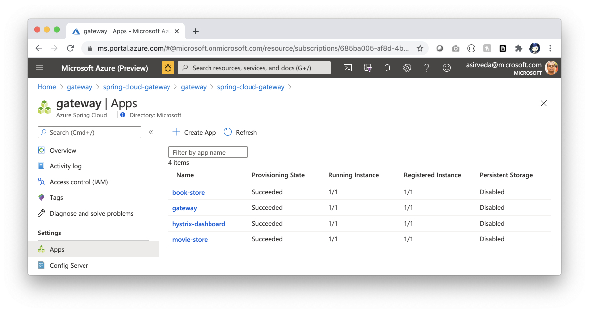
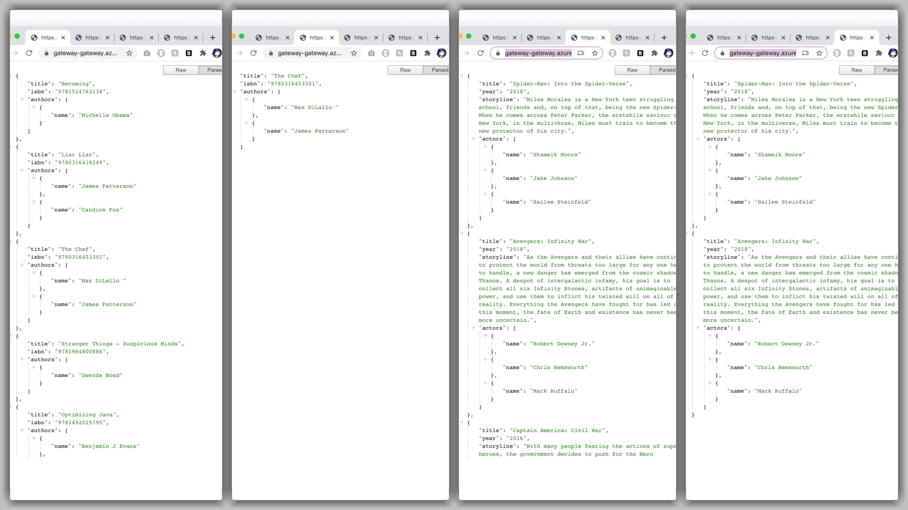

# Deploy Microservices and Spring Cloud Gateway using Azure Spring Cloud and Redis Cache 

Azure Spring Cloud enables you to easily run a Spring Boot based microservices application on Azure.

This quickstart shows you how to deploy an existing Java Spring Cloud application to Azure. When you're finished, you can continue to manage the application via the Azure CLI or switch to using the Azure portal.

## What will you experience
You will:
- Build existing Spring microservices applications
- Provision an Azure Spring Cloud service instance
- Deploy applications to Azure
- Bind Spring Cloud Gateway to Azure Redis Cache
- Open the application, test two microservices running behind a Spring Cloud Gateway
- Test Request Rate Limiter features in Spring Cloud Gateway

## What you will need

In order to deploy a Java app to cloud, you need 
an Azure subscription. If you do not already have an Azure 
subscription, you can activate your 
[MSDN subscriber benefits](https://azure.microsoft.com/pricing/member-offers/msdn-benefits-details/) 
or sign up for a 
[free Azure account]((https://azure.microsoft.com/free/)).

In addition, you will need the following:

| [Azure CLI version 2.0.67 or higher](https://docs.microsoft.com/cli/azure/install-azure-cli?view=azure-cli-latest) 
| [Java 8](https://www.azul.com/downloads/azure-only/zulu/?version=java-8-lts&architecture=x86-64-bit&package=jdk) 
| [Maven](https://maven.apache.org/download.cgi) 
| [Git](https://git-scm.com/)
|

## Install the Azure CLI extension

Install the Azure Spring Cloud extension for the Azure CLI using the following command

```bash
    az extension add --name spring-cloud
```

## Clone and build the repo

### Create a new folder and clone the sample app repository to your Azure Cloud account  

```bash
    mkdir source-code
    git clone https://github.com/azure-samples/spring-cloud-gateway
```

### Change directory and build the project

```bash
    cd spring-petclinic-gateway
    mvn clean package -DskipTests -Denv=cloud
```
This will take a few minutes.

## Provision Azure Spring Cloud service instance using Azure CLI

### Prepare your environment for deployments

Create a bash script with environment variables by making a copy of the supplied template:
```bash
    cp .scripts/setup-env-variables-azure-template.sh .scripts/setup-env-variables-azure.sh
```

Open `.scripts/setup-env-variables-azure.sh` and enter the following information:

```bash

    # ==== Resource Group ====
    export SUBSCRIPTION=685ba005-af8d-4b04-8f16-a7bf38b2eb5a # customize this
    export RESOURCE_GROUP=spring-cloud-gateway # customize this
    ...
    # ==== Service and App Instances ====
    export SPRING_CLOUD_SERVICE=gateway # customize this
    ...
    # ==== REDIS INFO ====
    export REDIS_CACHE_NAME=redis-4-gateway # customize this
```

Then, set the environment:
```bash
    source .scripts/setup-env-variables-azure.sh
```

### Login to Azure 
Login to the Azure CLI and choose your active subscription. Be sure to choose the active subscription that is whitelisted for Azure Spring Cloud

```bash
    az login
    az account list -o table
    az account set --subscription ${SUBSCRIPTION}
```

### Create Azure Spring Cloud service instance
Prepare a name for your Azure Spring Cloud service.  The name must be between 4 and 32 characters long and can contain only lowercase letters, numbers, and hyphens.  The first character of the service name must be a letter and the last character must be either a letter or a number.

Create a resource group to contain your Azure Spring Cloud service.

```bash
    az group create --name ${RESOURCE_GROUP} \
        --location ${REGION}
```

Create an instance of Azure Spring Cloud.

```bash
    az spring-cloud create --name ${SPRING_CLOUD_SERVICE} \
        --sku standard \
        --resource-group ${RESOURCE_GROUP} \
        --location ${REGION}
```

The service instance will take around five minutes to deploy.

Set your default resource group name and cluster name using the following commands:

```bash
    az configure --defaults \
        group=${RESOURCE_GROUP} \
        location=${REGION} \
        spring-cloud=${SPRING_CLOUD_SERVICE}
```

### Load Spring Cloud Config Server

Use the `application.yml` in the root of this project to load configuration into the Config Server in Azure Spring Cloud.

```bash
    az spring-cloud config-server set \
        --config-file application.yml \
        --name ${SPRING_CLOUD_SERVICE}
```

## Create Redis Cache

Use Azure CLI to create a Redis Cache

```bash
    az redis create \
        --name ${REDIS_CACHE_NAME} \
        --resource-group ${RESOURCE_GROUP} \
        --location ${REGION} \
        --vm-size C1 --sku Standard
    
    export REDIS_CACHE_RESOURCE_ID=$(az redis show --name ${REDIS_CACHE_NAME} | jq -r '.id')
```

## Create microservice applications

Create 4 microservice apps. And, bind the gateway app to Redis Cache.

```bash
    az spring-cloud app create --name ${GATEWAY} --instance-count 1 --is-public true \
        --memory 2 \
        --jvm-options='-Xms2048m -Xmx2048m'
    
    # ==== Bind Redis Cache ====
    az spring-cloud app binding redis add \
        --app ${GATEWAY} \
        --name redis \
        --resource-id ${REDIS_CACHE_RESOURCE_ID}
    
    az spring-cloud app create --name ${BOOK_STORE} --instance-count 1 \
        --memory 2 \
        --jvm-options='-Xms2048m -Xmx2048m'
    
    az spring-cloud app create --name ${MOVIE_STORE} --instance-count 1 \
        --memory 2 \
        --jvm-options='-Xms2048m -Xmx2048m'
    
    az spring-cloud app create --name ${HYSTRIX_DASHBOARD} --instance-count 1 --is-public true \
        --memory 2 \
        --jvm-options='-Xms2048m -Xmx2048m'
```

## Deploy applications

Deploy microservice applications to Azure.

```bash
    az spring-cloud app deploy --name ${GATEWAY} \
        --jar-path ${GATEWAY_JAR}
    
    az spring-cloud app deploy --name ${BOOK_STORE} \
        --jar-path ${BOOK_STORE_JAR}
    
    az spring-cloud app deploy --name ${MOVIE_STORE} \
        --jar-path ${MOVIE_STORE_JAR}
    
    az spring-cloud app deploy --name ${HYSTRIX_DASHBOARD} \
        --jar-path ${HYSTRIX_DASHBOARD_JAR}
```

Get the single entry point into Spring Cloud Gateway in Azure Spring Cloud.

```bash
    az spring-cloud app show --name ${GATEWAY} | grep url
```

Open the Azure Portal and navigate to the `Apps` blade in the newly created Azure Spring Cloud.



## Spring Cloud Gateway and Rate Limiting

Navigate to the URL provided by the previous command to open the Spring Cloud Gateway application.

```bash
    open https://${SPRING_CLOUD_SERVICE}-gateway.azuremicroservices.io/api/books
    open https://${SPRING_CLOUD_SERVICE}-gateway.azuremicroservices.io/api/books/isbn/9780316453301
    open https://${SPRING_CLOUD_SERVICE}-gateway.azuremicroservices.io/api/movies
    open https://${SPRING_CLOUD_SERVICE}-gateway.azuremicroservices.io/api/movies/year/2018
```
    


### Rate limiting
Rate limiting is mainly used to control the rate of traffic sent or received on the network. It helps to prevent decrease in the service quality or even outage due to high traffic and improve the reliability of the API. There are different types of rate limiting, each used to target a specific need.

Spring Cloud Gateway comes with a `RequestRateLimiter` filter to determine if the current request is allowed to proceed. It is supported using Redis Cache, that requires the use of the `spring-boot-starter-data-redis-reactive` Spring Boot starter.

This sample uses 2 additional parameters:

- `replenishRate`: represents how many requests per second a user is allowed to do
- `burstCapacity`: defines the maximum number of requests a user is allowed to do in a single second

`RequestRateLimiter` filter adds additional headers that indicate what is the rate limit for a client and how quickly it’s being used:

- `X-RateLimit-Replenish-Rate` indicates the replenishRate value.
- `X-RateLimit-Burst-Capacity` indicates the burstCapacity value.
- `X-RateLimit-Remaining` indicates how many calls you have remaining.

When request submissions exceed the replenish rate and burst limits, the gateway fails the limit-exceeding requests and returns 429 Too Many Requests error responses to the client.

```http request
curl -v https://gateway-gateway.azuremicroservices.io/api/books | jq -C
  % Total    % Received % Xferd  Average Speed   Time    Time     Time  Current
                                 Dload  Upload   Total   Spent    Left  Speed
  0     0    0     0    0     0      0      0 --:--:-- --:--:-- --:--:--     0*   Trying 40.64.133.29...
* TCP_NODELAY set
* Connected to gateway-gateway.azuremicroservices.io (40.64.133.29) port 443 (#0)
...
* Connection state changed (MAX_CONCURRENT_STREAMS updated)!
< HTTP/2 200 
< server: nginx/1.17.7
< date: Sun, 09 Aug 2020 22:04:51 GMT
< content-type: application/json;charset=UTF-8
< vary: Accept-Encoding
< vary: Accept-Encoding
< x-ratelimit-remaining: 1
< x-ratelimit-burst-capacity: 2
< x-ratelimit-replenish-rate: 2
< strict-transport-security: max-age=15724800; includeSubDomains
< 
{ [541 bytes data]
100   541    0   541    0     0   4237      0 --:--:-- --:--:-- --:--:--  4259
* Connection #0 to host gateway-gateway.azuremicroservices.io left intact
[
  {
    "title": "Becoming",
    "isbn": "9781524763138",
    "authors": [
      {
        "name": "Michelle Obama"
      }
    ]
  },
  {
    "title": "Liar Liar",
    "isbn": "9780316418249",
    "authors": [
      {
        "name": "James Patterson"
      },
      {
        "name": "Candice Fox"
      }
    ]
  },
  {
    "title": "The Chef",
    "isbn": "9780316453301",
    "authors": [
      {
        "name": "Max DiLallo "
      },
      {
        "name": "James Patterson"
      }
    ]
  },
  {
    "title": "Stranger Things - Suspicious Minds",
    "isbn": "9781984800886",
    "authors": [
      {
        "name": "Gwenda Bond"
      }
    ]
  },
  {
    "title": "Optimizing Java",
    "isbn": "9781492025795",
    "authors": [
      {
        "name": "Benjamin J Evans"
      },
      {
        "name": "James Gough"
      },
      {
        "name": "Chris Newland"
      }
    ]
  }
]
```

Repeatedly sending requests more than the request rate limit results in `HTTP 429 Too Many Requests` error responses to the client.

```http request
curl -v https://gateway-gateway.azuremicroservices.io/api/books | jq -C
  % Total    % Received % Xferd  Average Speed   Time    Time     Time  Current
                                 Dload  Upload   Total   Spent    Left  Speed
  0     0    0     0    0     0      0      0 --:--:-- --:--:-- --:--:--     0*   Trying 40.64.133.29...
...
* SSL connection using TLSv1.2 / ECDHE-RSA-AES128-GCM-SHA256
* ALPN, server accepted to use h2
* Server certificate:
*  subject: CN=*.azuremicroservices.io
*  start date: Oct 23 08:29:04 2019 GMT
*  expire date: Oct 23 08:29:04 2021 GMT
*  subjectAltName: host "gateway-gateway.azuremicroservices.io" matched cert's "*.azuremicroservices.io"
*  issuer: C=US; ST=Washington; L=Redmond; O=Microsoft Corporation; OU=Microsoft IT; CN=Microsoft IT TLS CA 4
*  SSL certificate verify ok.
* Using HTTP2, server supports multi-use
* Connection state changed (HTTP/2 confirmed)
* Copying HTTP/2 data in stream buffer to connection buffer after upgrade: len=0
* Using Stream ID: 1 (easy handle 0x7f9151008c00)
> GET /api/books HTTP/2
> Host: gateway-gateway.azuremicroservices.io
> User-Agent: curl/7.54.0
> Accept: */*
> 
* Connection state changed (MAX_CONCURRENT_STREAMS updated)!
< HTTP/2 429 
< server: nginx/1.17.7
< date: Sun, 09 Aug 2020 22:08:35 GMT
< content-length: 0
< x-ratelimit-remaining: 0
< x-ratelimit-burst-capacity: 2
< x-ratelimit-replenish-rate: 2
< strict-transport-security: max-age=15724800; includeSubDomains
< 
{ [0 bytes data]
  0     0    0     0    0     0      0      0 --:--:-- --:--:-- --:--:--     0
* Connection #0 to host gateway-gateway.azuremicroservices.io left intact
```

## Next Steps

In this quickstart, you've deployed an existing Spring microservices app using Azure CLI, Terraform and GitHub Actions. To learn more about Azure Spring Cloud, go to:

- [Spring Cloud Gateway](https://cloud.spring.io/spring-cloud-gateway/reference/html/)
- [Azure Spring Cloud](https://azure.microsoft.com/en-us/services/spring-cloud/)
- [Azure Spring Cloud docs](https://docs.microsoft.com/en-us/azure/java/)
- [Deploy Spring microservices from scratch](https://github.com/microsoft/azure-spring-cloud-training)
- [Deploy existing Spring microservices](https://github.com/Azure-Samples/spring-petclinic-microservices)
- [Azure for Java Cloud Developers](https://docs.microsoft.com/en-us/azure/java/)
- [Spring Cloud Azure](https://cloud.spring.io/spring-cloud-azure/)
- [Spring Cloud](https://spring.io/projects/spring-cloud)

## Credits

This Spring microservices sample is forked from 
[https://github.com/aboullaite/spring-cloud-gateway](https://github.com/aboullaite/spring-cloud-gateway) - see [aboullaite/spring-cloud-gateway README](./Readme-aboullaite-spring-cloud-gateway.md). 

## Contributing

This project welcomes contributions and suggestions.  Most contributions require you to agree to a
Contributor License Agreement (CLA) declaring that you have the right to, and actually do, grant us
the rights to use your contribution. For details, visit https://cla.opensource.microsoft.com.

When you submit a pull request, a CLA bot will automatically determine whether you need to provide
a CLA and decorate the PR appropriately (e.g., status check, comment). Simply follow the instructions
provided by the bot. You will only need to do this once across all repos using our CLA.

This project has adopted the [Microsoft Open Source Code of Conduct](https://opensource.microsoft.com/codeofconduct/).
For more information see the [Code of Conduct FAQ](https://opensource.microsoft.com/codeofconduct/faq/) or
contact [opencode@microsoft.com](mailto:opencode@microsoft.com) with any additional questions or comments.